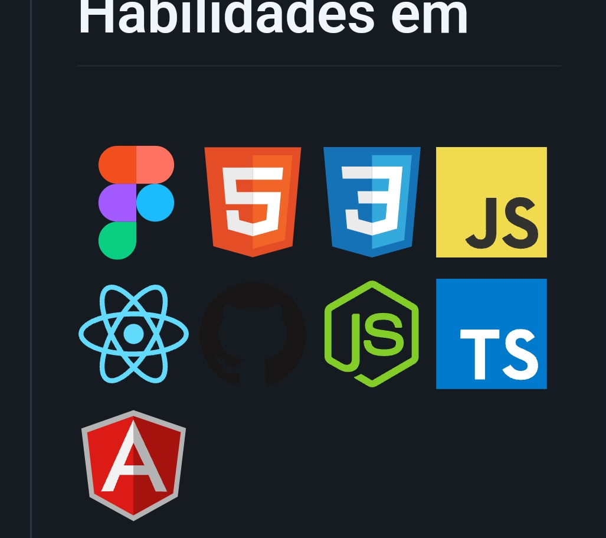

## Olá, meu nome é <strong>Gustavo Marcialis!</strong> 
  
  
  
  
  
  
  > Desenvolvedor Web Front-end e Back-end, formado no técnico em Informática para Internet pela Etec. Atuei como Professor de Programação e Algoritmo.
  
   > Minhas principais habilidades são Angular, Spring Boot, .Net, TypeScript, JavaScript, Java, C#, Bootstrap, SQL server, MySQL
  
  > Experiência em resolução de problemas e gestão de tempo adquiridos através de estudos, competências que coloquei em prática durante o desenvolvimento dos meus projetos, presentes no meu portfólio.
  
  > Sou uma pessoa  adaptável, colaborativa e persistente, habilidades que demonstrei no desenvolvimento do meu TCC no curso técnico.
  
 💬 Entre em contato comigo por Email, WhatsApp ou Linkedin! 

(13) 98221-9273            
  
 ---- 
 
 ## 🚀 Minhas Skills 
 
 - 
 - 
 - 
 - 
 - 
 - 
 - 
 - 
 - 
 - 
 - 
 - 
 - 
 - 
 - 
 - 
 - 
  
 --- 
 
 
